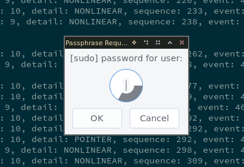
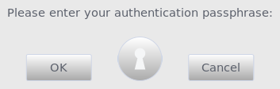

# Xaskpass
[](https://aur.archlinux.org/packages/xaskpass/)


Xaskpass is a lightweight passphrase dialog for X11 that is implemented without
relying on heavy GUI libraries. It aims to be a successor to the similar but now
old [x11-ssh-askpass]. It aims to preserve a fast startup time while modernizing
some features such as fonts. It also tries to make sure the password cannot leak
from the program to where it shouldn't.


<p align="center">

</p>
<p align="center">

</p>

[x11-ssh-askpass]: https://fedora.pkgs.org/32/fedora-x86_64/x11-ssh-askpass-1.2.4.1-30.fc32.x86_64.rpm.html
## Building

If the stars are aligned correctly this should suffice:

```sh
cargo build --release
```

Make sure you have the following dependencies installed:

* rust >= 1.45

* libxcb >= 1.12
* libxkbcommon
* libxkbcommon-x11
* xcb-util-errors
* cairo
* pango

For example in Arch Linux you can run:
```sh
pacman -S xcb-util-errors libxkbcommon libxkbcommon-x11 libxcb pango cairo
```

The compiled file is so large that it might affect the loading time unless it is stripped of
debug symbols:
```sh
strip target/release/xaskpass
```

## Installation
You can for example inform `ssh` or `sudo` to use `xaskpass` by setting
`SSH_ASKPASS=/path/to/xaskpass` or `SUDO_ASKPASS` (and using `sudo -A`) respectively.

## Configuration

Xaskpass reads configuration file from
`$XDG_CONFIG_HOME/xaskpass/xaskpass.toml`.
A default configuration file with comments can be found [here](xaskpass.default.toml).

## More help

See `xaskpass --help` and the comments in the shipped default configuration file.

## License

Xaskpass is released under the [Apache License, Version 2.0](LICENCE).
