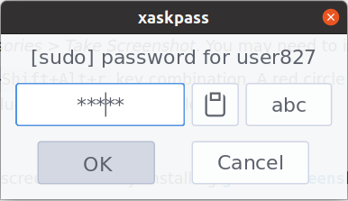

# Xaskpass
[](https://aur.archlinux.org/packages/xaskpass/)
[](https://crates.io/crates/xaskpass)


Xaskpass is a lightweight passphrase dialog for X11 with extensive configuration
options that is implemented without relying on heavy GUI libraries. It aims to
be a successor to the similar but now old [x11-ssh-askpass] by preserving
its fast startup time while modernizing some features such as fonts. It also tries
to make sure the password stays in the memory for the shortest time.

[x11-ssh-askpass]: https://archlinux.org/packages/community/x86_64/x11-ssh-askpass/

<p align="center">

</p>

Classic indicator | Circle | Strings/Disco
:-------:|:-------:|:-------:
 |  | 


## Building

If everything works right, a cargo build command should suffice:

```sh
cargo build --release --locked
```

Otherwise make sure `rustc` is 1.54+ and you have the following C libraries installed:

* libxcb >= 1.12
* libxkbcommon
* libxkbcommon-x11
* libclang
* cairo
* pango >= 1.46

For example in Arch Linux you can run:
```sh
pacman -S libxkbcommon libxkbcommon-x11 libxcb pango cairo clang
```

## Installation
To make `ssh` or `sudo` use `xaskpass` set
`SSH_ASKPASS=/path/to/xaskpass` or `SUDO_ASKPASS` (and use `sudo -A`) respectively.

## Configuration

Xaskpass reads configuration from
`$XDG_CONFIG_HOME/xaskpass/xaskpass.toml`.
A default configuration file with comments can be found [here](xaskpass.default.toml).

## More help

See `xaskpass --help` and the comments in [the default configuration
file](xaskpass.default.toml).

## Development

You can create directory `pregen` to speed up `build.rs` by letting it save the
generated bindings there.

## License

Xaskpass is released under the [Apache License, Version 2.0](LICENCE).

[Material Design](https://material.io/resources/icons/) [icon](res/xaskpass.png) by Google.
